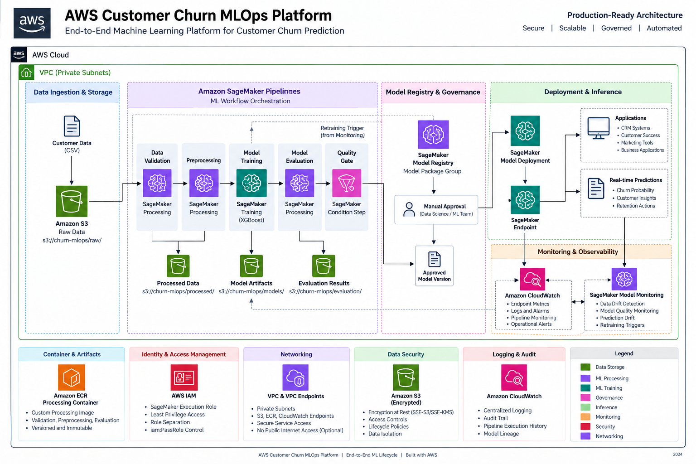

# AWS Customer Churn MLOps Platform — Architecture

## 1. Overview

The AWS Customer Churn MLOps Platform is designed as an end-to-end production machine learning architecture for predicting customer churn and operationalizing the resulting model.

The architecture covers the complete machine learning lifecycle:

* Data ingestion and storage
* Data validation
* Data preprocessing and feature engineering
* Model training
* Model evaluation
* Automated model quality gating
* Model registration and versioning
* Model approval
* Production deployment
* Real-time inference
* Monitoring and observability
* Drift detection
* Model retraining
* Security and network isolation

The platform uses managed AWS services wherever practical to reduce infrastructure management while maintaining reproducibility, traceability, security, and operational control.

---

## 2. Architecture Diagram



---

## 3. Architecture Objectives

The architecture is designed around the following objectives:

### Reproducibility

Every model should be traceable to:

* Source dataset
* Preprocessing implementation
* Container image
* Training configuration
* Hyperparameters
* Model artifact
* Evaluation results
* Pipeline execution

### Automation

Repeatable ML operations are orchestrated through Amazon SageMaker Pipelines rather than manually executing individual processing and training jobs.

### Model Governance

A model cannot proceed directly from training into production.

Models pass through:

```text
Training
    ↓
Evaluation
    ↓
Automated Quality Gate
    ↓
Model Registry
    ↓
Manual Approval
    ↓
Production Deployment
```

### Security

The platform applies:

* Least-privilege IAM
* Private networking
* Encryption
* S3 Block Public Access
* Controlled service-to-service access
* Centralized logging
* Model deployment governance

### Observability

Training, pipeline execution, inference, infrastructure, and model behavior are observable through AWS monitoring services.

### Cost Efficiency

Managed services and workload-specific compute are used so infrastructure exists primarily when workloads are executing.

---

# 4. High-Level Architecture

The platform consists of the following logical layers:

```text
┌─────────────────────────────┐
│     Customer Data Sources   │
└──────────────┬──────────────┘
               │
               ▼
┌─────────────────────────────┐
│          Amazon S3          │
│         Raw Dataset         │
└──────────────┬──────────────┘
               │
               ▼
┌──────────────────────────────────────────────┐
│            SageMaker Pipelines               │
│                                              │
│ Validation → Preprocess → Train → Evaluate  │
│                         → Quality Gate       │
└───────────────────────┬──────────────────────┘
                        │
                        ▼
              ┌─────────────────────┐
              │ SageMaker Model     │
              │ Registry            │
              └──────────┬──────────┘
                         │
                         ▼
                 Manual Approval
                         │
                         ▼
              ┌─────────────────────┐
              │ SageMaker Endpoint  │
              │ Real-Time Inference │
              └──────────┬──────────┘
                         │
              ┌──────────┴───────────┐
              ▼                      ▼
        Applications            Monitoring
                               / Drift Detection
                                      │
                                      ▼
                                  Retraining
```

---

# 5. End-to-End Architecture Flow

The complete model lifecycle follows:

```text
Customer Dataset
      │
      ▼
Amazon S3 Raw Zone
      │
      ▼
SageMaker Pipeline
      │
      ├── Data Validation
      │
      ├── Data Preprocessing
      │
      ├── Model Training
      │
      ├── Model Evaluation
      │
      └── Quality Gate
                │
                ▼
        SageMaker Model Registry
                │
                ▼
           Manual Approval
                │
                ▼
        SageMaker Deployment
                │
                ▼
        SageMaker Endpoint
                │
                ▼
       Real-Time Predictions
                │
                ▼
        Monitoring Layer
                │
                ▼
          Drift Detection
                │
                ▼
            Retraining
```

---

# 6. Data Architecture

## 6.1 Source Dataset

The platform uses the IBM Telco Customer Churn dataset.

The dataset contains:

* 7,043 customer records
* 21 original attributes
* Customer demographics
* Subscription information
* Contract information
* Service usage
* Billing information
* Churn labels

The prediction target is:

```text
Churn
```

with:

```text
Yes → Customer churned
No  → Customer retained
```

---

## 6.2 Amazon S3 Storage

Amazon S3 acts as the central durable storage layer for the ML platform.

It stores:

* Raw datasets
* Processed datasets
* Training datasets
* Validation datasets
* Test datasets
* Preprocessing artifacts
* Model artifacts
* Evaluation reports
* Predictions
* Monitoring data

The project bucket follows the naming pattern:

```text
s3://aws-customer-churn-mlops-<account-id>-<region>/
```

Logical organization:

```text
raw/
processed/
artifacts/
models/
monitoring/
```

Pipeline-generated artifacts are further separated using the SageMaker Pipeline Execution ID.

For example:

```text
processed/<PipelineExecutionId>/

artifacts/<PipelineExecutionId>/preprocessing/

artifacts/<PipelineExecutionId>/evaluation/
```

This prevents executions from overwriting one another and improves model lineage.

---

# 7. Data Validation Layer

Before preprocessing or training occurs, the incoming dataset is validated.

Validation checks include:

* Required columns
* Dataset schema
* Target column presence
* Missing values
* Invalid numeric values
* Unexpected categories
* Dataset dimensions
* Duplicate records
* Target distribution

A failed validation prevents invalid data from progressing further into the ML pipeline.

This provides an early control boundary between source data and downstream model development.

---

# 8. Data Preprocessing Architecture

Data preprocessing executes as a managed SageMaker Processing job.

The preprocessing layer performs:

* Data cleaning
* Missing-value handling
* Numeric conversion
* Categorical encoding
* Feature transformation
* Train/validation/test splitting
* Target encoding
* Artifact generation

The resulting datasets are stored in Amazon S3.

The current feature engineering process produces:

```text
45 model features
+
Churn target
```

Dataset split:

| Dataset    | Records |
| ---------- | ------: |
| Training   |   4,225 |
| Validation |   1,409 |
| Test       |   1,409 |

The preprocessing environment executes using a custom container stored in Amazon ECR.

This ensures that preprocessing behavior is reproducible across pipeline executions.

---

# 9. Container Architecture

Amazon Elastic Container Registry provides the container registry for custom ML processing workloads.

The processing image contains:

* Python runtime
* Data processing dependencies
* ML dependencies
* Validation dependencies
* Project processing code

The container is used by SageMaker Processing for:

* Data validation
* Data preprocessing
* Model evaluation

The architecture supports immutable image references through container image digests.

Example:

```text
633605692302.dkr.ecr.us-east-1.amazonaws.com/aws-customer-churn-processing@sha256:<digest>
```

Pinning the container image to a digest ensures that a pipeline execution cannot silently receive a different container version because a mutable image tag was updated.

---

# 10. Model Training Architecture

Model training is executed using Amazon SageMaker managed training infrastructure.

The model uses XGBoost for binary classification.

The managed training image is:

```text
sagemaker-xgboost:1.7-1
```

Primary training configuration:

```text
objective           = binary:logistic
eval_metric         = logloss
num_round           = 200
max_depth           = 4
eta                 = 0.05
subsample           = 0.8
colsample_bytree    = 0.8
scale_pos_weight    ≈ 2.769
```

The class weighting compensates for the imbalance between retained and churned customers.

Training data is read from Amazon S3.

After training completes, SageMaker packages the trained model artifact and writes it back to Amazon S3.

---

# 11. Model Evaluation Architecture

After training, the generated model is evaluated against validation data.

Evaluation executes as a separate SageMaker Processing job.

The evaluation process generates:

* Accuracy
* Precision
* Recall
* F1 score
* ROC-AUC
* Predictions
* Evaluation report

The primary machine-readable evaluation artifact is:

```text
evaluation.json
```

Predictions are persisted separately as:

```text
predictions.csv
```

The evaluation output is stored under:

```text
artifacts/<PipelineExecutionId>/evaluation/
```

This separates evaluation artifacts by pipeline execution and maintains traceability between a trained model and its corresponding evaluation results.

---

# 12. Model Quality Gate

The architecture contains an automated model quality gate between model evaluation and model registration.

The minimum acceptance criteria are:

| Metric   | Threshold |
| -------- | --------: |
| F1 Score |    ≥ 0.60 |
| Recall   |    ≥ 0.70 |
| ROC-AUC  |    ≥ 0.75 |

The SageMaker Pipeline reads metrics directly from:

```text
evaluation.json
```

The pipeline evaluates:

```text
F1 >= 0.60
AND
Recall >= 0.70
AND
ROC-AUC >= 0.75
```

Only models satisfying all required quality criteria are eligible for registration.

This prevents a technically successful training job from automatically becoming a production candidate when its predictive performance is inadequate.

---

# 13. Model Performance

The baseline XGBoost model achieved the following validation results:

| Metric    | Validation |
| --------- | ---------: |
| Accuracy  |     0.7466 |
| Precision |     0.5153 |
| Recall    |     0.7647 |
| F1        |     0.6157 |
| ROC-AUC   |     0.8381 |

Final test performance:

| Metric    |   Test |
| --------- | -----: |
| Accuracy  | 0.7537 |
| Precision | 0.5244 |
| Recall    | 0.7754 |
| F1        | 0.6257 |
| ROC-AUC   | 0.8429 |

The model therefore satisfies the defined model quality thresholds.

---

# 14. SageMaker Pipeline Architecture

Amazon SageMaker Pipelines acts as the central orchestration service.

The pipeline coordinates the complete machine learning workflow.

```
flowchart LR

    A[Raw Data] --> B[Validate Data]

    B --> C[Preprocess Data]

    C --> D[Train XGBoost Model]

    D --> E[Evaluate Model]

    E --> F{Quality Gate}

    F -->|Pass| G[Register Model]

    F -->|Fail| H[Reject Candidate]

    G --> I[Manual Approval]

    I --> J[Deploy Model]

    J --> K[SageMaker Endpoint]

    K --> L[Monitoring]

    L --> M{Drift Detected?}

    M -->|Yes| A
```

Pipeline orchestration provides:

* Repeatability
* Execution history
* Dependency management
* Automated artifact flow
* Quality enforcement
* Model lineage
* Controlled deployment progression

---

# 15. Model Registry and Governance

Models that pass the automated quality gate are registered in SageMaker Model Registry.

The registry provides a controlled model lifecycle.

Each registered model version contains information such as:

* Model artifact location
* Container image
* Model metrics
* Model version
* Approval state
* Creation timestamp
* Associated evaluation results

Typical lifecycle:

```text
Training
   ↓
Evaluation
   ↓
Quality Gate
   ↓
Model Registry
   ↓
Pending Manual Approval
   ↓
Approved
   ↓
Deployment
```

The registry therefore acts as the governance boundary between model development and production deployment.

---

# 16. Approval Architecture

Automated model quality checks are necessary but do not independently authorize production deployment.

A model entering the registry is assigned an approval state.

Example:

```text
PendingManualApproval
```

An authorized reviewer evaluates:

* Evaluation metrics
* Model version
* Pipeline execution
* Training configuration
* Business suitability
* Operational considerations

The model is then explicitly:

```text
Approved
```

or:

```text
Rejected
```

Only approved model versions are eligible for production deployment.

This separates:

```text
Technical model validation
```

from:

```text
Production authorization
```

---

# 17. Deployment Architecture

Approved model versions are deployed using Amazon SageMaker managed inference.

Deployment flow:

```text
SageMaker Model Registry
        │
        ▼
Approved Model Version
        │
        ▼
SageMaker Model
        │
        ▼
Endpoint Configuration
        │
        ▼
SageMaker Endpoint
```

The endpoint hosts the model behind a managed HTTPS inference API.

SageMaker manages:

* Model container startup
* Compute provisioning
* Endpoint lifecycle
* Health monitoring
* Invocation handling
* Scaling configuration

---

# 18. Inference Architecture

Applications submit customer feature data to the SageMaker endpoint.

Example flow:

```text
CRM / Customer Success Application
               │
               ▼
        AWS Application Layer
               │
               ▼
        SageMaker Endpoint
               │
               ▼
        XGBoost Model
               │
               ▼
        Churn Probability
               │
               ▼
        Business Workflow
```

The resulting prediction can support actions such as:

* Retention campaigns
* Customer-success prioritization
* Proactive account outreach
* Risk segmentation
* Retention offer targeting

The ML platform produces predictions, while downstream business systems determine the appropriate customer intervention.

---

# 19. Deployment Strategies

Production model updates can use controlled deployment strategies.

## Blue/Green Deployment

A new model version is deployed separately from the existing production model.

Traffic is shifted only after validation.

This provides a rollback path if the new model behaves unexpectedly.

## Canary Deployment

A small percentage of production traffic can initially be directed to a new model version.

Operational and model metrics are observed before increasing traffic.

## Rolling Model Replacement

Where risk and traffic characteristics permit, the endpoint configuration can be updated to transition toward the new model version.

The appropriate deployment strategy depends on:

* Business criticality
* Request volume
* Model risk
* Rollback requirements
* Cost constraints

---

# 20. Monitoring Architecture

Production ML systems require monitoring at multiple levels.

The architecture therefore separates:

1. Infrastructure monitoring
2. Application monitoring
3. Model monitoring

---

## 20.1 Infrastructure Monitoring

Amazon CloudWatch captures operational metrics such as:

* Endpoint invocations
* Invocation errors
* Model latency
* CPU utilization
* Memory utilization
* Instance health
* Processing job failures
* Training job failures
* Pipeline execution failures

CloudWatch Logs centralizes logs from SageMaker workloads.

---

## 20.2 Application Monitoring

The inference layer should track:

* Request volume
* Failed requests
* Response latency
* Prediction errors
* Invalid request payloads
* Upstream/downstream integration failures

These metrics help distinguish model problems from application or infrastructure problems.

---

## 20.3 Model Monitoring

SageMaker Model Monitor provides monitoring capabilities for production inference data.

Monitoring can detect:

* Feature drift
* Data quality changes
* Distribution changes
* Prediction drift
* Model quality degradation

Production observations are compared against a baseline established from training or validation data.

---

# 21. Drift Detection and Retraining

A production model can degrade even when infrastructure remains healthy.

Customer behavior may change over time due to:

* Pricing changes
* New products
* Contract changes
* Competitor behavior
* Economic conditions
* Changes in customer demographics

The monitoring layer therefore feeds the retraining lifecycle.

```text
Production Endpoint
        │
        ▼
Inference Data
        │
        ▼
Model Monitoring
        │
        ▼
Drift Detection
        │
        ▼
Threshold Breach
        │
        ▼
Retraining Pipeline
        │
        ▼
New Model Candidate
        │
        ▼
Evaluation
        │
        ▼
Quality Gate
        │
        ▼
Model Registry
```

Retraining does not bypass the normal model governance process.

A retrained model must still:

* Be evaluated
* Pass quality thresholds
* Be registered
* Receive approval
* Pass deployment controls

---

# 22. IAM Architecture

AWS IAM provides the authorization layer for the platform.

The architecture separates human identities from workload identities.

```text
Developer / CI/CD Identity
          │
          │ iam:PassRole
          ▼
SageMaker Pipeline Execution Role
          │
          ├── Amazon S3
          ├── Amazon ECR
          ├── SageMaker Processing
          ├── SageMaker Training
          ├── SageMaker Models
          ├── SageMaker Endpoints
          └── Amazon CloudWatch
```

The SageMaker execution role is trusted by:

```text
sagemaker.amazonaws.com
```

The role receives permissions required to:

* Read source data
* Write processed artifacts
* Pull ECR images
* Create processing jobs
* Create training jobs
* Create models
* Register model versions
* Create endpoint configurations
* Create endpoints
* Write logs and metrics

The developer or CI/CD identity receives `iam:PassRole` only for the specific SageMaker execution role required by the platform.

This prevents arbitrary role delegation.

---

# 23. Security Architecture

Security controls are applied across the data, execution, deployment, and monitoring layers.

## Identity Security

IAM policies follow least privilege.

Permissions are separated between:

* Developers
* CI/CD workloads
* SageMaker workloads
* Deployment operations

## Data Security

Amazon S3 provides:

* Block Public Access
* Encryption at rest
* Bucket policies
* Versioning where required
* Controlled IAM access

Sensitive production customer data should not be publicly accessible.

## Container Security

Container images are stored in private Amazon ECR repositories.

Production images should be:

* Versioned
* Scanned
* Access controlled
* Preferably referenced using immutable digests

## Model Security

Model artifacts are stored in private S3 locations.

Model deployment permissions are separated from model training permissions where organizational requirements justify stronger separation of duties.

## Logging and Audit

AWS logging services provide visibility into infrastructure and API activity.

Relevant controls include:

* CloudWatch Logs
* CloudTrail
* SageMaker execution history
* Model Registry history

---

# 24. Network Architecture

Production SageMaker workloads are designed to operate within an Amazon VPC.

The architecture uses private subnets for ML workloads where appropriate.

```text
                    Amazon VPC

        ┌───────────────────────────────┐
        │        Private Subnets        │
        │                               │
        │  SageMaker Processing Jobs   │
        │  SageMaker Training Jobs     │
        │  SageMaker Endpoint          │
        │                               │
        └──────────────┬────────────────┘
                       │
                       ▼
                VPC Endpoints
                       │
          ┌────────────┼─────────────┐
          ▼            ▼             ▼
         S3           ECR       CloudWatch
```

VPC endpoints can provide private access to AWS services including:

* Amazon S3
* Amazon ECR API
* Amazon ECR Docker registry
* Amazon CloudWatch Logs
* AWS STS
* SageMaker APIs

Private connectivity reduces dependence on public internet access.

Security groups restrict network traffic according to workload requirements.

---

# 25. Encryption Architecture

Encryption is applied at multiple layers.

## Encryption at Rest

Applicable resources include:

* Amazon S3 objects
* ECR images
* SageMaker storage
* Model artifacts
* Monitoring outputs

AWS managed encryption or customer-managed AWS KMS keys can be selected according to compliance requirements.

## Encryption in Transit

AWS service APIs use TLS.

Inference requests to SageMaker endpoints are transmitted over HTTPS.

Private service connectivity through VPC endpoints further reduces exposure to public network paths.

---

# 26. Observability Architecture

Observability covers the complete ML lifecycle.

```text
SageMaker Pipeline
       │
       ├── Processing Logs
       ├── Training Logs
       ├── Evaluation Logs
       └── Pipeline Status
                │
                ▼
          Amazon CloudWatch


SageMaker Endpoint
       │
       ├── Invocation Metrics
       ├── Error Metrics
       ├── Latency Metrics
       └── Resource Metrics
                │
                ▼
          Amazon CloudWatch


Production Predictions
       │
       ▼
SageMaker Model Monitor
       │
       ├── Data Quality
       ├── Data Drift
       └── Model Quality
```

CloudWatch alarms can notify operations teams when defined thresholds are exceeded.

---

# 27. Artifact Lineage

Artifact lineage is central to the architecture.

A production model should be traceable through:

```text
Production Endpoint
       │
       ▼
Model Version
       │
       ▼
Model Registry
       │
       ▼
Model Artifact
       │
       ▼
Training Job
       │
       ▼
Processed Dataset
       │
       ▼
Preprocessing Job
       │
       ▼
Raw Dataset
```

Pipeline execution identifiers are incorporated into S3 artifact paths to prevent overwriting and improve traceability.

This supports questions such as:

* Which data trained this model?
* Which preprocessing version was used?
* Which container produced the dataset?
* Which hyperparameters were used?
* What metrics did the model achieve?
* Which pipeline execution produced the model?
* Who approved the model?
* Which model version is currently deployed?

---

# 28. Scalability Architecture

The architecture separates storage and compute.

Amazon S3 provides independently scalable object storage.

SageMaker Processing and Training provision compute for individual jobs rather than requiring permanently running processing infrastructure.

Production inference capacity can scale independently from model training infrastructure.

This allows:

```text
Data Storage
Training Compute
Processing Compute
Inference Compute
```

to scale according to their own workload characteristics.

---

# 29. Availability and Resilience

Amazon S3 provides durable storage for datasets and ML artifacts.

Pipeline jobs are stateless and can be re-executed using persisted artifacts.

Model Registry preserves model versions independently from individual training jobs.

Production endpoint resilience can be increased through:

* Multiple instances
* Auto Scaling
* Multi-AZ infrastructure managed by SageMaker
* Health monitoring
* Controlled deployment strategies

The architecture avoids relying on local developer storage for production ML artifacts.

---

# 30. Cost Architecture

The architecture is designed to avoid permanently running infrastructure where it is unnecessary.

## Processing

SageMaker Processing instances exist only while validation, preprocessing, or evaluation jobs execute.

## Training

SageMaker Training compute exists only during model training.

## Storage

Amazon S3 provides low-cost durable storage for datasets and artifacts.

Lifecycle policies can transition older artifacts to lower-cost storage classes where retention requirements permit.

## Container Registry

Amazon ECR stores reusable processing container images without requiring dedicated container infrastructure.

## Inference

The primary persistent cost is the production inference endpoint.

For low-volume workloads, alternative inference strategies may be evaluated, including:

* SageMaker Serverless Inference
* Asynchronous Inference
* Batch Transform

The appropriate inference architecture should be selected according to latency, throughput, and availability requirements.

---

# 31. Architecture Decisions

## Managed SageMaker Training Instead of Self-Managed EC2

SageMaker Training eliminates the need to maintain dedicated ML training servers and integrates directly with the pipeline lifecycle.

## SageMaker Pipelines Instead of Manual Orchestration

Pipeline orchestration provides reproducibility, dependency management, execution history, and automated workflow control.

## Custom ECR Processing Container

A custom container provides deterministic dependencies across validation, preprocessing, and evaluation workloads.

## Amazon S3 as the Artifact Store

S3 provides durable, scalable, and cost-effective storage with native integration across SageMaker services.

## XGBoost for the Baseline Model

XGBoost provides strong performance for structured tabular classification workloads while maintaining relatively low training and inference complexity.

## Automated Quality Gate

Model registration is conditional on measurable performance rather than simply successful job execution.

## Model Registry Before Deployment

The registry provides model versioning and creates a governance boundary between experimentation and production.

## Manual Production Approval

Automated evaluation verifies technical quality, while explicit approval provides an additional control before a model can affect production systems.

## Managed SageMaker Endpoint

Managed inference reduces the operational overhead associated with building and maintaining custom model-serving infrastructure.

## CloudWatch and Model Monitor

Infrastructure monitoring and model monitoring address different failure modes and are therefore both required in the production architecture.

---

# 32. Separation of Responsibilities

The platform deliberately separates responsibilities across the ML lifecycle.

| Layer                | Responsibility                        |
| -------------------- | ------------------------------------- |
| Amazon S3            | Dataset and artifact storage          |
| SageMaker Processing | Validation, preprocessing, evaluation |
| Amazon ECR           | Processing container registry         |
| SageMaker Training   | Model training                        |
| SageMaker Pipelines  | ML workflow orchestration             |
| Quality Gate         | Automated model acceptance            |
| Model Registry       | Model versioning and governance       |
| Manual Approval      | Production authorization              |
| SageMaker Endpoint   | Real-time model serving               |
| CloudWatch           | Operational monitoring                |
| Model Monitor        | Model/data monitoring                 |
| IAM                  | Authorization                         |
| VPC                  | Network isolation                     |

This reduces coupling and provides clearer security and operational boundaries.

---

# 33. Production MLOps Lifecycle

The final production lifecycle is:

```text
                         ┌──────────────────┐
                         │    Raw Data      │
                         └────────┬─────────┘
                                  │
                                  ▼
                         ┌──────────────────┐
                         │    Validation    │
                         └────────┬─────────┘
                                  │
                                  ▼
                         ┌──────────────────┐
                         │  Preprocessing   │
                         └────────┬─────────┘
                                  │
                                  ▼
                         ┌──────────────────┐
                         │     Training     │
                         └────────┬─────────┘
                                  │
                                  ▼
                         ┌──────────────────┐
                         │    Evaluation    │
                         └────────┬─────────┘
                                  │
                                  ▼
                         ┌──────────────────┐
                         │   Quality Gate   │
                         └────────┬─────────┘
                                  │
                             Pass │
                                  ▼
                         ┌──────────────────┐
                         │  Model Registry  │
                         └────────┬─────────┘
                                  │
                                  ▼
                         ┌──────────────────┐
                         │ Manual Approval  │
                         └────────┬─────────┘
                                  │
                                  ▼
                         ┌──────────────────┐
                         │    Deployment    │
                         └────────┬─────────┘
                                  │
                                  ▼
                         ┌──────────────────┐
                         │     Endpoint     │
                         └────────┬─────────┘
                                  │
                                  ▼
                         ┌──────────────────┐
                         │    Monitoring    │
                         └────────┬─────────┘
                                  │
                           Drift? │
                                  ▼
                         ┌──────────────────┐
                         │    Retraining    │
                         └────────┬─────────┘
                                  │
                                  └──────────────► Validation
```

---

# 34. Architecture Principles

The final architecture follows these principles:

### Reproducibility

Data, code, containers, configuration, and artifacts are versioned or traceable.

### Automation

Repeatable ML operations are automated through SageMaker Pipelines.

### Governance

Models are evaluated, registered, versioned, and explicitly approved before production deployment.

### Least Privilege

IAM permissions are limited according to workload responsibilities.

### Private-by-Default Infrastructure

Production ML workloads use private networking and controlled AWS service access.

### Immutable Artifacts

Container images and model artifacts are versioned to prevent uncontrolled changes.

### Observability

Infrastructure, pipeline, endpoint, and model behavior are monitored independently.

### Controlled Deployment

Production promotion is treated as a governed operation rather than a direct consequence of training.

### Resilience

Durable artifacts and managed infrastructure allow workloads to be reproduced or redeployed.

### Cost Awareness

Compute is provisioned according to workload requirements instead of maintaining unnecessary always-on infrastructure.

---

# 35. Final Architecture Summary

The AWS Customer Churn MLOps Platform implements a complete machine learning lifecycle using AWS managed services.

The architecture integrates:

```text
Amazon S3
      ↓
SageMaker Processing
      ↓
SageMaker Training
      ↓
SageMaker Evaluation
      ↓
Automated Quality Gate
      ↓
SageMaker Model Registry
      ↓
Manual Approval
      ↓
SageMaker Managed Inference
      ↓
Amazon CloudWatch
      +
SageMaker Model Monitor
      ↓
Retraining
```

Amazon ECR provides reproducible processing environments, IAM provides workload authorization, and the VPC architecture provides network isolation.

The resulting design separates data engineering, model development, governance, deployment, security, and operations while maintaining traceability across the complete model lifecycle.

