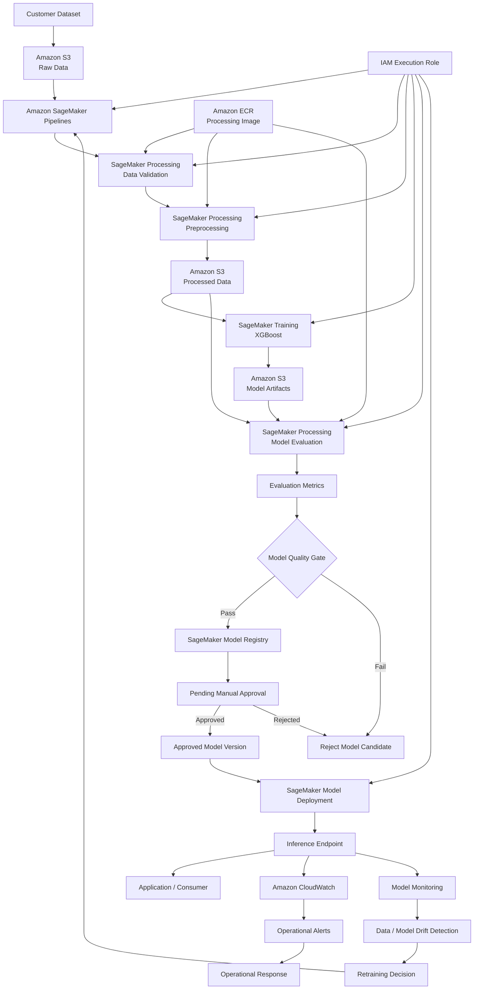

# AWS Customer Churn MLOps Platform — Architecture

The AWS Customer Churn MLOps Platform provides an end-to-end machine learning architecture for predicting customer churn, governing model promotion, deploying approved models, and monitoring production performance.

## Architecture Diagram


The architecture uses managed AWS services to separate the machine learning lifecycle into distinct concerns:

* data storage
* data validation
* preprocessing
* model training
* model evaluation
* quality control
* model governance
* deployment
* inference
* monitoring
* retraining

Amazon SageMaker provides the core ML execution and orchestration capabilities, while Amazon S3, Amazon ECR, AWS IAM, and Amazon CloudWatch provide the supporting storage, container, security, and observability layers.


# 1. High-Level Architecture




# 2. Architecture Flow

The machine learning lifecycle follows a controlled progression:

```text
Raw Customer Data
        │
        ▼
Amazon S3
        │
        ▼
Data Validation
        │
        ▼
Data Preprocessing
        │
        ▼
Model Training
        │
        ▼
Model Evaluation
        │
        ▼
Quality Gate
        │
        ├──────────── FAIL ────────────► Reject Candidate
        │
       PASS
        │
        ▼
SageMaker Model Registry
        │
        ▼
Pending Manual Approval
        │
        ├────────── REJECTED ──────────► No Deployment
        │
     APPROVED
        │
        ▼
Model Deployment
        │
        ▼
Inference Endpoint
        │
        ├────────────► Application / Consumer
        │
        └────────────► Monitoring
                              │
                              ▼
                    Drift / Quality Detection
                              │
                              ▼
                     Retraining Decision
                              │
                              ▼
                     SageMaker Pipeline
```

The architecture deliberately separates **model training**, **model qualification**, **model approval**, and **model deployment**.

A successful training job therefore does not automatically result in a production deployment.


# 3. Data Architecture

## Amazon S3

Amazon S3 provides the persistent storage layer for the ML lifecycle.

The logical bucket structure separates raw data, transformed datasets, model artifacts, and evaluation artifacts.

```text
s3://<project-bucket>/
│
├── raw/
│   └── telco/
│
├── processed/
│   └── <pipeline-execution-id>/
│
├── artifacts/
│   └── <pipeline-execution-id>/
│       ├── preprocessing/
│       └── evaluation/
│
└── customer-churn-training/
```

### Raw Data

The `raw/` prefix contains the source customer dataset in its original form.

Raw data is treated as immutable input to the ML workflow.

### Processed Data

The `processed/` prefix contains model-ready datasets generated by the preprocessing stage.

Each pipeline execution writes to an execution-specific prefix.

### Pipeline Artifacts

The `artifacts/` hierarchy stores preprocessing and evaluation outputs associated with individual pipeline executions.

### Training Artifacts

Model artifacts generated by SageMaker Training are persisted independently from the ephemeral training infrastructure.


# 4. Data Validation Layer

Data validation is executed before preprocessing and training.

```text
Amazon S3
    │
    ▼
Raw Dataset
    │
    ▼
SageMaker Processing
    │
    ▼
Validation Rules
    │
    ├── Schema Validation
    ├── Required Columns
    ├── Target Validation
    ├── Data Type Validation
    ├── Missing / Malformed Values
    └── Dataset Integrity
            │
            ▼
       Valid Dataset
```

The validation stage provides an explicit boundary between source data and the downstream ML workflow.

Invalid input data prevents downstream processing rather than allowing malformed data to propagate into model training.


# 5. Preprocessing Architecture

Validated data is passed to a dedicated SageMaker Processing workload.

```text
Validated Dataset
        │
        ▼
SageMaker Processing
        │
        ├── Data Cleaning
        ├── Numeric Conversion
        ├── Categorical Encoding
        ├── Feature Transformation
        ├── Dataset Splitting
        └── Preprocessing Artifacts
                │
                ▼
             Amazon S3
                │
        ┌───────┼────────┐
        │       │        │
        ▼       ▼        ▼
      Train  Validation  Test
```

The processing stage generates consistent datasets for training and evaluation while maintaining a reproducible transformation process.


# 6. Container Architecture

Project-specific processing workloads execute inside a custom Docker environment.

```text
Source Code
    │
    ▼
Docker Build
    │
    ▼
Processing Image
    │
    ▼
Amazon ECR
    │
    ▼
Immutable Image Digest
    │
    ├────────► Validation
    ├────────► Preprocessing
    └────────► Evaluation
```

Amazon ECR stores the processing container.

The SageMaker Pipeline references the container using an immutable image digest rather than depending exclusively on mutable image tags.

This ensures that pipeline executions can be tied to a specific processing environment.


# 7. Training Architecture

Model training executes as a managed SageMaker Training Job.

```text
Amazon S3
Processed Training Data
        │
        ▼
SageMaker Training
        │
        ▼
AWS Managed XGBoost Container
        │
        ▼
Trained XGBoost Model
        │
        ▼
Model Artifact
        │
        ▼
Amazon S3
```

The training environment is independent from the custom processing environment.

This allows project-specific processing logic to use a controlled custom container while training uses the SageMaker-managed XGBoost training environment.


# 8. Model Evaluation Architecture

The trained model is evaluated before it becomes eligible for registration.

```text
Model Artifact ──────────┐
                         │
Validation Dataset ──────┼──► SageMaker Processing
                         │
                         ▼
                    Model Evaluation
                         │
                 ┌───────┴────────┐
                 │                │
                 ▼                ▼
        evaluation.json    predictions.csv
                 │
                 ▼
         Pipeline Metrics
```

The evaluation stage calculates:

* Accuracy
* Precision
* Recall
* F1 Score
* ROC-AUC

The resulting evaluation artifact becomes the source of truth for automated model-quality decisions.


# 9. Model Quality Gate

Training success and model quality are treated as separate conditions.

The model must satisfy all defined minimum thresholds:

```text
F1 Score >= 0.60

Recall   >= 0.70

ROC-AUC  >= 0.75
```

The decision flow is:

```text
Evaluation Metrics
        │
        ▼
┌──────────────────────┐
│  Model Quality Gate  │
└──────────┬───────────┘
           │
     ┌─────┴─────┐
     │           │
    PASS        FAIL
     │           │
     ▼           ▼
  Register     Reject
   Model      Candidate
```

Only qualifying models continue into the governance lifecycle.


# 10. Model Registry and Governance

Amazon SageMaker Model Registry provides the governance boundary between model development and deployment.

```text
Qualified Model
      │
      ▼
SageMaker Model Registry
      │
      ▼
Model Package Group
      │
      ▼
Model Version
      │
      ▼
Pending Manual Approval
      │
   ┌──┴─────────────┐
   │                │
Approved         Rejected
   │                │
   ▼                ▼
Deployment      No Promotion
```

Each qualifying model is stored as a versioned model package.

The registry maintains the controlled progression of model candidates through the deployment lifecycle.


# 11. Approval Architecture

Model quality alone does not authorize production deployment.

The model enters the registry with an approval state requiring an explicit governance decision.

```text
Automated Controls
       │
       ▼
Quality Gate
       │
       ▼
Model Registry
       │
       ▼
Manual Governance Control
       │
       ▼
Model Approval
       │
       ▼
Production Deployment
```

This creates two distinct controls:

### Automated Technical Control

Determines whether the model satisfies minimum performance requirements.

### Manual Governance Control

Determines whether an otherwise qualifying model is authorized for deployment.

This prevents pipeline execution from implicitly becoming production authorization.


# 12. Deployment Architecture

Approved model versions are deployed through SageMaker.

```text
SageMaker Model Registry
        │
        ▼
Approved Model Version
        │
        ▼
SageMaker Model
        │
        ▼
Endpoint Configuration
        │
        ▼
SageMaker Endpoint
        │
        ▼
Real-Time Inference
```

The serving infrastructure is independent of the training infrastructure.

This allows inference capacity to be managed according to production traffic rather than training requirements.


# 13. Inference Architecture

The deployed model exposes a managed inference interface.

```text
Application / Consumer
        │
        ▼
Inference Request
        │
        ▼
SageMaker Endpoint
        │
        ▼
Customer Feature Vector
        │
        ▼
XGBoost Model
        │
        ▼
Churn Probability
        │
        ▼
Application / Retention Workflow
```

The prediction can be consumed by systems such as:

* CRM applications
* customer-success platforms
* retention workflows
* internal analytics systems
* marketing automation systems

The inference layer remains logically decoupled from the model-development pipeline.


# 14. MLOps Orchestration

Amazon SageMaker Pipelines provides the workflow orchestration layer.

```text
┌─────────────────────────────────────────────┐
│          Amazon SageMaker Pipeline          │
│                                             │
│   Validation                               │
│       │                                     │
│       ▼                                     │
│   Preprocessing                             │
│       │                                     │
│       ▼                                     │
│   Training                                  │
│       │                                     │
│       ▼                                     │
│   Evaluation                                │
│       │                                     │
│       ▼                                     │
│   Quality Gate                              │
│       │                                     │
│       ▼                                     │
│   Model Registration                        │
│                                             │
└─────────────────────────────────────────────┘
```

The pipeline provides explicit dependencies between ML lifecycle stages.

A downstream stage executes only when its upstream requirements have been satisfied.


# 15. IAM Architecture

The architecture separates the identity initiating ML operations from the workload identity used by SageMaker.

```text
┌────────────────────────┐
│ Developer / CI Identity│
└────────────┬───────────┘
             │
             │ SageMaker API Operations
             │ iam:PassRole
             ▼
┌───────────────────────────────┐
│ SageMaker Execution Role      │
└────────────┬──────────────────┘
             │
     ┌───────┼─────────┬───────────┐
     │       │         │           │
     ▼       ▼         ▼           ▼
    S3      ECR    SageMaker   CloudWatch
```

## Developer / CI Identity

The initiating identity is responsible for operations such as:

* creating or updating pipelines
* starting pipeline executions
* initiating deployments
* passing the approved SageMaker execution role

## SageMaker Execution Role

The SageMaker workload identity receives only the permissions required to interact with the resources used by the ML workflow.

These include controlled access to:

* project S3 resources
* required ECR repositories
* SageMaker workloads
* CloudWatch Logs
* required supporting AWS APIs

## `iam:PassRole`

The initiating identity is restricted to passing the designated SageMaker execution role rather than arbitrary IAM roles.

This maintains separation between workload permissions and human or CI permissions.


# 16. Security Architecture

Security controls are applied across identity, data, compute, and deployment layers.

```text
                 Security Architecture
                         │
       ┌─────────────────┼─────────────────┐
       │                 │                 │
       ▼                 ▼                 ▼
   Identity             Data            Workloads
       │                 │                 │
       ▼                 ▼                 ▼
Least Privilege     Encryption       IAM Execution Role
Role Separation     S3 Controls      Controlled Containers
PassRole Control    Access Policy    Managed Compute
```

Core security principles include:

* least-privilege IAM
* separation of human and workload identities
* controlled `iam:PassRole`
* restricted S3 access
* encrypted storage
* reproducible container images
* controlled model promotion
* centralized operational logging
* auditable model lifecycle


# 17. Network Architecture

Production SageMaker workloads operate within a controlled VPC architecture.

```text
                         AWS VPC
                           │
             ┌─────────────┴─────────────┐
             │                           │
             ▼                           ▼
      Private Subnet A            Private Subnet B
             │                           │
             └─────────────┬─────────────┘
                           │
                           ▼
                  SageMaker Workloads
                           │
          ┌────────────────┼────────────────┐
          │                │                │
          ▼                ▼                ▼
     S3 Endpoint      ECR Endpoints   CloudWatch
                                      Logs Endpoint
```

SageMaker workloads use private networking where required, with VPC endpoints providing private connectivity to supporting AWS services.

Relevant endpoint access includes:

* Amazon S3
* Amazon ECR API
* Amazon ECR Docker registry
* CloudWatch Logs
* other required AWS service APIs

This reduces reliance on public-network paths for internal ML workload communication.


# 18. Observability Architecture

The platform separates infrastructure observability from ML observability.

```text
                     Production Model
                           │
             ┌─────────────┴─────────────┐
             │                           │
             ▼                           ▼
     Operational Metrics           ML Metrics
             │                           │
             ▼                           ▼
     Amazon CloudWatch         Model Monitoring
             │                           │
             ▼                           ▼
     Logs / Metrics / Alarms      Drift / Quality
             │                           │
             └─────────────┬─────────────┘
                           ▼
                     Alerting Layer
                           │
                           ▼
                  Operational Response
```

## Infrastructure Monitoring

Amazon CloudWatch provides visibility into:

* endpoint invocations
* invocation errors
* latency
* pipeline failures
* processing failures
* training failures
* resource utilization
* operational logs

## ML Monitoring

Model monitoring observes:

* input-data characteristics
* feature distributions
* prediction distributions
* model quality
* data drift
* model-performance degradation


# 19. Retraining Architecture

Monitoring feeds a controlled retraining lifecycle.

```text
Production Model
      │
      ▼
Model Monitoring
      │
      ▼
Drift / Performance Signal
      │
      ▼
Retraining Trigger
      │
      ▼
SageMaker Pipeline
      │
      ▼
New Model Candidate
      │
      ▼
Evaluation
      │
      ▼
Quality Gate
      │
      ▼
Model Registry
      │
      ▼
Approval
      │
      ▼
Deployment
```

Retraining does not bypass model governance.

Every retrained model becomes a new candidate and must pass evaluation, quality controls, registration, and approval before replacing an existing production model.


# 20. Artifact Lineage

Pipeline artifacts are isolated by execution.

```text
Pipeline Execution
       │
       ├── Execution ID
       │
       ├── Processed Dataset
       │
       ├── Preprocessing Artifacts
       │
       ├── Model Artifact
       │
       ├── Evaluation Results
       │
       └── Model Version
```

Execution-specific S3 paths establish traceability between pipeline runs and generated artifacts.

Combined with model versioning in SageMaker Model Registry, this allows a production model to be traced back through its ML lifecycle.


# 21. Scalability Architecture

Storage, processing, training, and inference scale independently.

```text
                    ML Platform
                        │
       ┌────────────────┼────────────────┐
       │                │                │
       ▼                ▼                ▼
      Data            Training        Inference
       │                │                │
       ▼                ▼                ▼
   Amazon S3       SageMaker Jobs    SageMaker
                                    Endpoint
```

Amazon S3 scales independently of compute workloads.

SageMaker Processing and Training resources exist only for the duration of their workloads.

Inference capacity is managed independently according to production traffic.

This prevents training requirements from dictating production-serving capacity.


# 22. Availability and Resilience

The architecture avoids maintaining persistent infrastructure for batch ML operations.

```text
Persistent Layer
     │
     ├── Amazon S3
     ├── Amazon ECR
     └── Model Registry

Ephemeral Compute
     │
     ├── Processing Jobs
     └── Training Jobs

Serving Layer
     │
     └── SageMaker Endpoint
```

Separating durable artifacts from ephemeral compute allows processing and training workloads to be recreated without coupling their lifecycle to stored datasets or model artifacts.

Pipeline orchestration also provides a consistent mechanism for rerunning failed or updated workflows.


# 23. Cost Architecture

The architecture minimizes persistent compute during model development and training.

Processing and training infrastructure is provisioned for individual jobs and terminated after completion.

```text
Processing Job
      │
      ▼
Execute Workload
      │
      ▼
Terminate Compute
```

```text
Training Job
      │
      ▼
Train Model
      │
      ▼
Persist Artifact
      │
      ▼
Terminate Compute
```

Primary cost drivers are:

* SageMaker Processing
* SageMaker Training
* SageMaker inference
* Amazon S3 storage
* Amazon ECR storage
* CloudWatch logs and metrics
* data transfer where applicable

Cost controls include:

* workload-specific instance sizing
* managed spot training where appropriate
* S3 lifecycle management
* execution-artifact retention policies
* inference-capacity optimization
* separation of ephemeral and persistent infrastructure


# 24. Architecture Decisions

## Amazon S3 for ML Data and Artifacts

S3 provides durable storage independent of the lifecycle of processing and training infrastructure.

It establishes persistent boundaries between pipeline stages and supports execution-specific artifact organization.

## SageMaker Processing for Validation and Transformation

Processing workloads are separated from model training because data validation, transformation, and evaluation have different responsibilities from optimization of the ML model itself.

## Custom Containers for Processing

Custom Docker containers provide explicit control over:

* runtime dependencies
* Python packages
* preprocessing logic
* evaluation logic
* reproducibility

## Managed XGBoost for Training

SageMaker-managed XGBoost provides a managed training environment without requiring the project to maintain an unnecessary custom training container.

## SageMaker Pipelines for ML Orchestration

The workflow contains ML-specific dependencies between datasets, processing outputs, model artifacts, evaluation metrics, and model versions.

SageMaker Pipelines provides the orchestration layer for these dependencies.

## Automated Model Quality Gate

Model training success is not equivalent to model suitability.

Explicit metric thresholds provide an automated technical control before model registration.

## SageMaker Model Registry for Governance

The registry separates model generation from production authorization and provides model versioning and approval-state management.

## Manual Approval Before Production

Human approval provides an additional governance boundary between automated model qualification and production deployment.

## Execution-Scoped Artifact Paths

Pipeline execution identifiers prevent artifact collisions and provide a foundation for model lineage.

## Dedicated SageMaker Execution Role

Workload permissions are isolated from developer or CI permissions through a dedicated SageMaker execution role.

## Managed Services First

Managed AWS services are used where they reduce operational overhead while preserving the required security, governance, and workload controls.


# 25. End-to-End Architecture

The resulting platform can be summarized as:

```text
                         CUSTOMER DATA
                              │
                              ▼
                         AMAZON S3
                              │
                              ▼
                  ┌─────────────────────┐
                  │ SAGEMAKER PIPELINE  │
                  └──────────┬──────────┘
                             │
                             ▼
                       VALIDATION
                             │
                             ▼
                      PREPROCESSING
                             │
                             ▼
                          TRAINING
                             │
                             ▼
                         EVALUATION
                             │
                             ▼
                       QUALITY GATE
                             │
                    ┌────────┴────────┐
                    │                 │
                  PASS              FAIL
                    │                 │
                    ▼                 ▼
              MODEL REGISTRY      REJECT
                    │
                    ▼
             MANUAL APPROVAL
                    │
             ┌──────┴──────┐
             │             │
          APPROVED      REJECTED
             │             │
             ▼             ▼
         DEPLOYMENT      STOP
             │
             ▼
      SAGEMAKER ENDPOINT
             │
       ┌─────┴──────┐
       │            │
       ▼            ▼
 APPLICATION     MONITORING
                    │
                    ▼
             DRIFT / QUALITY
                    │
                    ▼
               RETRAINING
                    │
                    └──────────────► SAGEMAKER PIPELINE
```


# 26. Architecture Principles

The final architecture follows six core principles.

### Reproducibility

Pipeline code, processing containers, parameters, and artifacts provide repeatable ML execution.

### Traceability

Pipeline executions, datasets, model artifacts, evaluation results, and model versions remain associated throughout the model lifecycle.

### Separation of Concerns

Data storage, processing, training, governance, serving, security, and monitoring remain independent architectural responsibilities.

### Security by Design

IAM boundaries, controlled role passing, private networking, encryption, and workload isolation are incorporated into the architecture.

### Governed Model Promotion

A model must pass both automated quality controls and governance approval before production deployment.

### Operational Feedback

Production monitoring feeds back into the ML lifecycle, allowing degradation or drift to initiate controlled retraining and model replacement.

